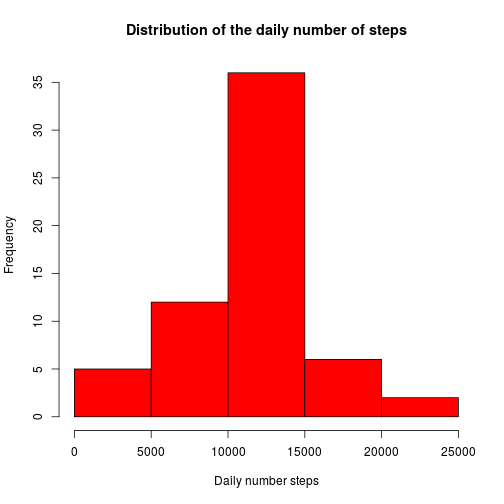

## Loading and preprocessing the data

First, we unzip data and load them into a data table _dt_:

```r
library(data.table)
```

```
## data.table 1.9.4  For help type: ?data.table
## *** NB: by=.EACHI is now explicit. See README to restore previous behaviour.
```

```r
f <- unzip("activity.zip")
dt <- data.table(read.csv(f))
```
The uncompressed file can be deleted:

```r
invisible(file.remove(f))
```
Let's look at the structure of the file:

```r
str(dt)
```

```
## Classes 'data.table' and 'data.frame':	17568 obs. of  3 variables:
##  $ steps   : int  NA NA NA NA NA NA NA NA NA NA ...
##  $ date    : Factor w/ 61 levels "2012-10-01","2012-10-02",..: 1 1 1 1 1 1 1 1 1 1 ...
##  $ interval: int  0 5 10 15 20 25 30 35 40 45 ...
##  - attr(*, ".internal.selfref")=<externalptr>
```
The _date_ column needs to be converted, since it is represented as factor

```r
dt$date <- as.Date(dt$date, format = "%Y-%m-%d")
str(dt)
```

```
## Classes 'data.table' and 'data.frame':	17568 obs. of  3 variables:
##  $ steps   : int  NA NA NA NA NA NA NA NA NA NA ...
##  $ date    : Date, format: "2012-10-01" "2012-10-01" ...
##  $ interval: int  0 5 10 15 20 25 30 35 40 45 ...
##  - attr(*, ".internal.selfref")=<externalptr>
```
## What is mean total number of steps taken per day?

We need to group the rows by _date_ and compute the sum of each group.
As specified in the assignment, we can ignore the _NA_ values. 
Let's create a table _st_, containing this informaton, and rename the columns:

```r
st <- dt[!is.na(steps), sum(steps), by = date]
setnames(st, c("date","sum.steps"))
```
Now, it is possible to plot an histogram of the total daily number of steps, and to show summary statistics, including mean and median:

```r
hist(st$sum.steps, xlab = "Daily number steps", ylab = "Frequency", col = 'red', main = "Distribution of the daily number of steps")
```

 

```r
summary(st$sum.steps)
```

```
##    Min. 1st Qu.  Median    Mean 3rd Qu.    Max. 
##      41    8841   10760   10770   13290   21190
```

## What is the average daily activity pattern?

First, we compute the mean of steps grouping the rows by _interval_, and save the result into the table _it_. 
In order to understand better the time of the day of each 5-minute interval, we create the additional column _time_.
Then, we rename the columns:

```r
it <- dt[!is.na(steps), mean(steps), by = interval]
it$time <- paste(sprintf("%02d", it$interval %/% 100),":",sprintf("%02d", it$interval %% 100),sep="")
it
```

```
##      interval        V1  time
##   1:        0 1.7169811 00:00
##   2:        5 0.3396226 00:05
##   3:       10 0.1320755 00:10
##   4:       15 0.1509434 00:15
##   5:       20 0.0754717 00:20
##  ---                         
## 284:     2335 4.6981132 23:35
## 285:     2340 3.3018868 23:40
## 286:     2345 0.6415094 23:45
## 287:     2350 0.2264151 23:50
## 288:     2355 1.0754717 23:55
```

```r
setnames(it, c("interval","avg.steps", "time"))
```

Now, it is possible to plot the time series. On the x-axis the time of day is shown, which is better readable than the identifier of the interval.

```r
plot(it$interval, it$avg.steps, type = "l", xaxt="n", xlab = "Time", ylab = "Average number of steps")
axis(1, at=it$interval[seq(1, length(it$interval), 24)], labels=it$time[seq(1, length(it$time), 24)])
```

 
Finally, the interval with the maximum number of steps can be found by selecting the row of _it_ with the maximum value of avg.steps:

```r
max <- it[which.max(avg.steps)]
max
```

```
##    interval avg.steps  time
## 1:      835  206.1698 08:35
```
The interval number 835 has the maximum average number of steps (namely, 206.1698113) and corresponds to time 08:35.
This is also well visible in the plot of the time series, shown above.

## Imputing missing values

The _summary_ function can be used to show the number of _NA_ values inf _dt_:

```r
summary(dt)
```

```
##      steps             date               interval     
##  Min.   :  0.00   Min.   :2012-10-01   Min.   :   0.0  
##  1st Qu.:  0.00   1st Qu.:2012-10-16   1st Qu.: 588.8  
##  Median :  0.00   Median :2012-10-31   Median :1177.5  
##  Mean   : 37.38   Mean   :2012-10-31   Mean   :1177.5  
##  3rd Qu.: 12.00   3rd Qu.:2012-11-15   3rd Qu.:1766.2  
##  Max.   :806.00   Max.   :2012-11-30   Max.   :2355.0  
##  NA's   :2304
```

As we can see, only the _steps_ column contains _NA_ values.
We can set the missing number of steps as suggested by the assignment: for each row with missing numer of steps, we set the value as the average numer of steps in that interval.


```r
dt2 <- dt
for (i in 1:nrow(dt2)) {
    if (is.na(dt2[i, ]$steps)) {
        #TODO: this is quite slow - check if it can be optimized
        dt2[i, ]$steps <- as.integer(round(it[interval == dt2[i, ]$interval, ]$avg.steps))
    }
}
```

We can construct the histogram of the total number of daily steps as we did before, and show summary statistics, including mean and median:

```r
st2 <- dt2[, sum(steps), by = date]
setnames(st2, c("date","sum.steps"))
hist(st2$sum.steps, xlab = "Daily number steps", ylab = "Frequency", col = 'red', main = "Distribution of the daily number of steps")
```

 

```r
summary(st2$sum.steps)
```

```
##    Min. 1st Qu.  Median    Mean 3rd Qu.    Max. 
##      41    9819   10760   10770   12810   21190
```

The mean and the median of the distribution have not changed. In order to understand the reason why they did not change, we can analyze the distribution of the _NA_ values in the _dt_ table, w.r.t. the date:


```r
dtna <- dt[, sum(is.na(steps)), by = date]
setnames(dtna, c("date", "na.count"))
dtna[na.count>0]
```

```
##          date na.count
## 1: 2012-10-01      288
## 2: 2012-10-08      288
## 3: 2012-11-01      288
## 4: 2012-11-04      288
## 5: 2012-11-09      288
## 6: 2012-11-10      288
## 7: 2012-11-14      288
## 8: 2012-11-30      288
```

As we can see, all the days with _NA_ values have 288 _NA_ values. Since 288 is the number of 5-minutes intervals in a day, in the initial distribution each day has either no _NA_ only or only _NA_ values. Therefore, replacing the number of steps with the average number of steps for each interval, clearly does not change how the daily total number of steps is distributed.
Probably, a more effective way to replace _NA_ values would be replacing them with the average number of steps in the same interval of the same day of the week (this should work well if the subject who produced the readings usually does the same activities during the same days of the week).

## Are there differences in activity patterns between weekdays and weekends?

First we create a factor variable _day.type_ with two levels: _weekday_ and _weekend_.

```r
dt$day.type <- as.factor(ifelse(weekdays(dt$date) %in% c("Sunday","Saturday"), "weekend", "weekday"))
```

Then, we can aggregate data by _interval_ and _day.type_, computing the mean of the number of steps, and, finally, it is possible to create a panel plot that allows to compare the time series of the average number of steps in the 5-minutes intervals of the weekdays and weekends.


```r
it2 <- aggregate(steps ~ interval + day.type, dt, mean)
setnames(it2, c("interval","day.type","avg.steps"))
library(lattice)
xyplot(avg.steps ~ interval | day.type, data = it2, type = "l", xlab="5-minutes interval", ylab="Average number of steps", layout=c(1,2))
```

 
From the time series it can be observed that the subject typically starts walking earlier during he weekdays and walks more during the central hours of the weekends than during the same hours of the weekdays. This could be a clue that the subject wakes up early to go to work during the weekdays and tends to spend some time outside during the weekends.
